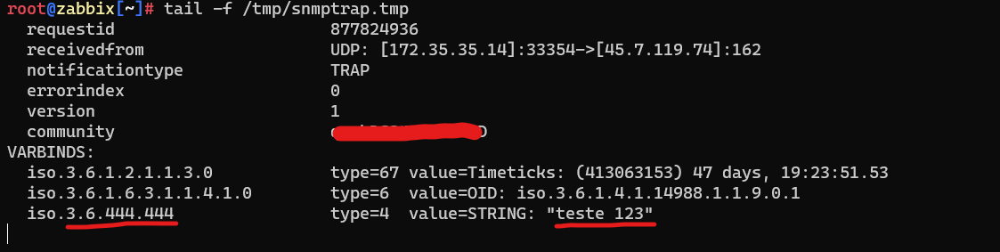

# Mikrotik BGP + SNMPTRAP

## Monitoramento de sessões bgp na Mikrotik com snmp trap

### Apoio

* [Webinars JLCP - Configurando SNMPTRAP no Zabbix com Robert Silva](https://youtu.be/t9REGzRneGQ)
  * [Robert Silva - robertsilvatech](https://github.com/robertsilvatech)
* [SNMP TRAP com Zabbix e Mikrotik](https://youtu.be/-lWz4pZxems)

```sh
apt install snmptrap libsnmp-perl perl libxml-simple-perl
cd /etc/zabbix
wget -O https://raw.githubusercontent.com/prelegalwonder/zabbix/master/misc/snmptrap/zabbix_trap_receiver.pl
nano zabbix_trap_receiver.pl
```

> $SNMPTrapperFile = '/tmp/snmptrap.tmp';

```sh
nano /etc/zabbix/zabbix_server.conf
```

> SNMPTrapperFile=/tmp/snmptrap.tmp
> StartSNMPTrapper=1

```sh
nano /etc/snmp/snmptrapd.conf
```

> authCommunity log,execute,net <COMINUDADE_SNMP>
>
> perl do "/etc/zabbix/zabbix_trap_receiver.pl";


```sh
service zabbix-server restart
service snmptrapd restart
```

### Na sua mikrotik envie um trap para testar se ta tudo funcionando

```rsc
/snmp send-trap oid=1.2.2.1.2 type=string value="teste 123"
```

```sh
tail -f /tmp/snmptrap.tmp
```


