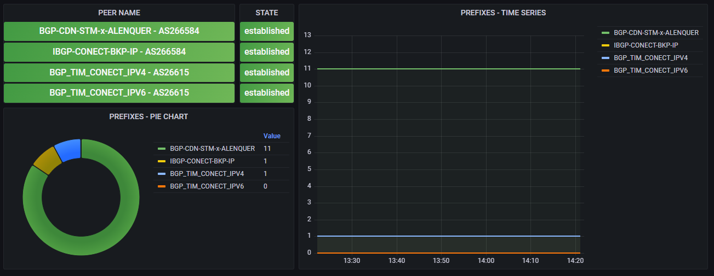

# Mikrotik BGP + SNMPTRAP

## Monitoramento de sessões bgp na Mikrotik com snmp trap



---

### Referência

* [Webinars JLCP - Configurando SNMPTRAP no Zabbix com Robert Silva](https://youtu.be/t9REGzRneGQ)
  * [Robert Silva - robertsilvatech](https://github.com/robertsilvatech)
* [SNMP TRAP com Zabbix e Mikrotik](https://youtu.be/-lWz4pZxems)
* [Remontti - Monitorando no Zabbix as sessões BGP do RouterOS v6 (Mikrotik) via SNMP](https://blog.remontti.com.br/6175)

---

```sh
apt install snmptrap libsnmp-perl perl libxml-simple-perl
cd /etc/zabbix
wget -O https://raw.githubusercontent.com/prelegalwonder/zabbix/master/misc/snmptrap/zabbix_trap_receiver.pl
```

---

```sh
nano zabbix_trap_receiver.pl
```

> $SNMPTrapperFile = '/tmp/snmptrap.tmp';

---

```sh
nano /etc/zabbix/zabbix_server.conf
```

> SNMPTrapperFile=/tmp/snmptrap.tmp
>
> StartSNMPTrapper=1

---

```sh
nano /etc/snmp/snmptrapd.conf
```

> authCommunity log,execute,net <COMINUDADE_SNMP>
>
> perl do "/etc/zabbix/zabbix_trap_receiver.pl";


---

```sh
service zabbix-server restart
service snmptrapd restart
```

---

### Na sua mikrotik envie um trap para testar se ta tudo funcionando

```rsc
/snmp send-trap oid=1.3.6.444.444 type=string value="teste 123"
```

```sh
tail -f /tmp/snmptrap.tmp
```


---

## ZABBIX TEMPLATE

### [Baixe o template aqui](/contents/MIkrotik%20BGP%20-%20SNMPTRAP.yaml)


---

## SCRIPT MIKROTIK

### [Baixe o script aqui](/contents/script_mikrotic.rsc)

```sh
:global data "name,disabled,state,remoteaddress,remoteas,prefix,uptime";
foreach id in=[/routing bgp peer find] do={
    :global name [/routing bgp peer get value-name=name $id];
    :global disabled [/routing bgp peer get value-name=disabled $id];
    :global state [/routing bgp peer get value-name=state $id];
        :if (state = "idle") do={:set state 1};
        :if (state = "connect") do={:set state 2}
        :if (state = "active") do={:set state 3}; 
        :if (state = "opensent") do={:set state 4}
        :if (state = "openconfirm") do={:set state 5}; 
        :if (state = "established") do={:set state 6};
        :if (disabled) do={:set state 1};
    :global remoteaddress [/routing bgp peer get value-name=remote-address $id];
    :global remoteas [/routing bgp peer get value-name=remote-as $id];
    :global prefix [/routing bgp peer get value-name=prefix $id];
        :if (prefix < 1) do={:set prefix 0;}

    :global uptime [/routing bgp peer get value-name=uptime $id];
        :if (uptime < 1) do={:set uptime 0;}
            :global uptimeseconds 0; :global weekend 0; 
            :global dayend 0; :global weeks 0; :global days 0;
        :if ([:find $uptime "w" -1] > 0) do={
            :set weekend [:find $uptime "w" -1];
            :set weeks [:pick $uptime 0 $weekend];
            :set weekend ($weekend+1);
        };
        :if ([:find $uptime "d" -1] > 0) do={
            :set dayend [:find $uptime "d" -1];
            :set days [:pick $uptime $weekend $dayend];
        };
        :global time [:pick $uptime ([:len $uptime]-8) [:len $uptime]];
        :global hours [:pick $time 0 2];
        :global minutes [:pick $time 3 5];
        :global seconds [:pick $time 6 8];

        :set uptimeseconds [($weeks*86400*7+$days*86400+$hours*3600+$minutes*60+$seconds)];

    :set $data ($data."|".$name.",".$disabled.",".$state.",".$remoteaddress.",".$remoteas.",".$prefix.",".$uptimeseconds);

};
/snmp send-trap oid=1.3.6.444.444 type=string value="$data"
```
